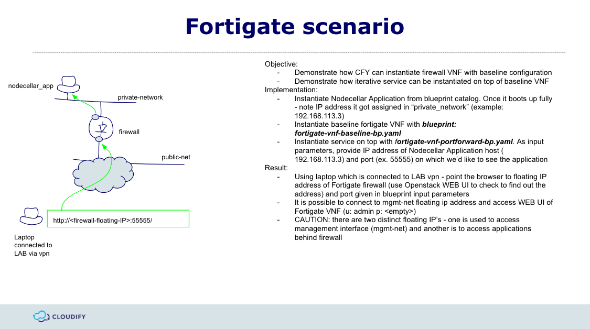

# Fortigate simple service blueprint

The puprose of this blueprint is to demonstrate how with CFY we can instantiate firewall VNF (Fortigate in this case) with baseline configuration and later on how to instantiate serrvice on top of it.
Plugins used:
* proxy plugin
* terminal plugin
* openstack plugin

Use case requires two blueprints:
* fortigate-vnf-baseline-bp.yaml
* fortigate-vnf-portforward-bp.yaml

### fortigate-vnf-baseline-bp.yaml
This blueprint uploads fortigate image from AWS S3 and instantiates VM from that image. Image is configured to receive IP address on port1 from DHCP therefore we're able to access it with WEB UI or CLI. Login credentials:
username: admin
password: <empty>
Once VNF is up, then CFY uses terminal plugin to configure VNF with baseline configuration.

### fortigate-vnf-portforward-bp.yaml
Blueprint is responsible for instantiation of simple portforwarding service on top of EXISTING VNF configured with another blueprint. Portforwarding is a method of exposing resources which are behind firewall. In this example we'll have some application running behind firewall on port 8080 and we'll be exposing it on public intergace of firewall on port 55555. In order to do that we use proxy-plugin. Proxy plugin node takes two parameters:
* blueprint name (of existing deployment)
* deployment name (of exisitng deployment).
In case of fortigate-vnf-portforward-bp.yaml - these are burned in a blueprint code:
```
node_templates:

  fortigate_vnf_deployment:
    type: cloudify.nodes.DeploymentProxy
    properties:
      resource_config:
        blueprint:
          id: fortigate-vnf-baseline-bp
          external_resource: true
        deployment:
          id: fortigate-vnf-baseline-deployment
          external_resource: true
          outputs:
            fortigate_vnf_mgmt_ip: mgmt_ip
 ```
 Therefore it's important to use same names once instantiating baseline blueprint. They can be parametrized as input therefore if you prefer, do not hesitate to change it.
Proxy plugin is necessary, because we're going to instantiate portforwarding service on top of EXISTING deployment - demonstrating how we can provide service chaining.

### How to use it?
Best is to use CFY Labs with V4 template and use CFY CLI. In a first stage we need baseline VNF:
```sh
cfy install -d fortigate-vnf-baseline-deployment -b fortigate-vnf-baseline-bp ./fortigate-vnf-baseline-bp.yaml
```
it's good to have some application behind firewall. You can use nodecellar or whatever you prefer. Configuration template is prepared for nodecellar which exposes application on port 8080 (look into template files)
Once it's up, we can move to second stage which is instantiation of portforwarding service. First we need to edit input file and provide IP address of application we want to expose and port on which we want to expose it:
```
portforward_port: '55555'
portforward_ip: '192.168.113.3'   <---- nodecellar IP 
```

```sh
cfy install -d fortigate-vnf-portforward-deployment -b fortigate-vnf-portforward-bp -i fortigate-vnf-portforward-bp-input.yaml ./fortigate-vnf-portforward-bp.yaml
```

Once deployment is ready, you can point your browser to: http://<floating_ip_address_of_firewall_pub_interface>:55555 and you should see nodecellar app.





